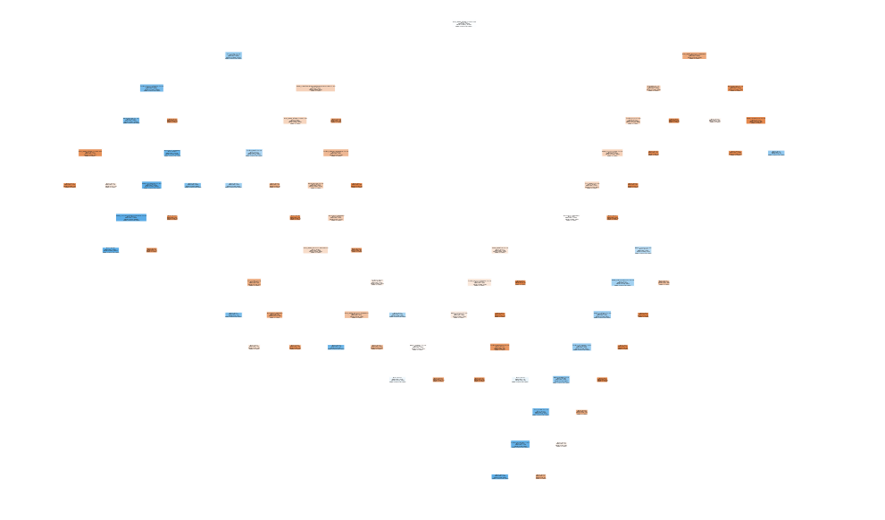

# Capstone: Broadway Grosses

## 1 Project Description
This is my capstone project for Flatiron School.  In this project is an extensive look at the weekly grossings of Broadway shows for the years 2015-2019.  The ultimate purpose was to asses the data and make accurate predictions about when a show will close.

For organization purposes this project has been broken down into 3 parts as follows:

**Baseline Modeling**
In this section is an in depth Exploratory Data Analysis of Broadway weekly grosses, types of shows, and other important features that may influence whether a show will close or not.  Logistic Regression, SVM, Random Forest, XGBoost are used as baseline modeling techniques while addressing things like class imabalance.  

**ANN for Broadway Grosses**
Using the Keras API an Artificial Neural Network is constructed to use sophisticated algorithms to determine if a Broadway show should close or not.

**Wicked Time Series Analysis**
The core to this data is the passage of time and how much money the show is making.  It is essential to take an in depth look at time series, how it can influence our predictions, and its components like seasonality.  It is concluded with a prediction of how much money the Broadway show Wicked lost the first year of COVID-19.

### 1.1 The data
This data was orginally parsed from the Broadway League website and can be found [here](https://www.broadwayleague.com/research/grosses-broadway-nyc/#weekly_grosses).

The Broadway League is an internationally recognized organization that maintains the standards and efficacy of Broadway shows.  Although they print the weekly grosses, they are not connected with the production companies and they do not record the grosses.  The grosses are recorded by the box office that remains a neutral 3rd party.  
The original data came with 12 features:

|Feature|Description|
|:----:|:----:|
|date|Past 5 years of all Broadway data.|
|show|Name of the show.|
|type|Distinguished by Play, Musical, or Special.|
|theatre|Which physical theatre the show takes place at.|
|previews|How many of the performances were previews.|
|performances|How many performances occured not including previews.|
|grosses|Total revenue generated before running costs.|
|prev week grosses|The revenue generated from the previous week.|
|GG%GP|This is the percentage of the revenue generated out of the possible grossings. Number is defined by every seat in the house being sold at full price.|
|attendance|How many people attended the Performance.|
|prev week attendance|How many people attended last week.|
|%capacity|How much of the theatre was full.|

In addition I added four rows as additional features:

|Feature|Description|
|:---:|:---:|
|Close Month| This demarcates the month of closing.|
|Genre|Includes: Mystery, Comedy, Drama, Alternative, Jukebox, Tragedy|
|Tony Noms|The number of Tony nominations the show recieved.|
|Tony Awards|The number of Tony awards the show won.|

The information for the above rows came from Wikipedia which I usually refrain from using.  However, their sources checked out for features like number of Tony awards, and their tables were the most clean and precise from all of the sources maintaining Tony award information.

### 1.2 Cleaning the Data

The data cleaning for this project was relatively simple.  Since this was a custome data set there were almost no missing values.  The only missing values came from shows who had just opened and therefore had no previous weeks information to report. These values were removed.  

### 1.3 The Business Problem

The idea behind this capstone is to create a model that can be turned into a usable interface for Producers to help them determine when a show should close.  Many times you can look at all of the numbers and go on gut feeling, but a system that would take into account exact differences in the numbers from week to week is ideal.

The idea is that we can demarcate the last 6 weeks of a show's life in order to tell the computer that the show is closing.  The model should take into account all of the other features that are happening to that show during that time and create pattern recognition that allows it to flag new information.

Above is a visual representation of what this project is trying to accomplish.  The red portion notates visually the weeks of closing that were marked with a 1 in the dataframe.  The other weeks of this show not in red are marked with a 0.  Since a computer cannot read this graph like we could, we have to tell it what is happening.

## 2 Exploratory Data Analysis

### 2.1 
Looking below we can get an idea of how things would influence our data.  

## 3 Time Series Analysis of Wicked

Wicked was one of the most stable business models in the bunch.  Aside from seasonal spikes and trends, Wicked had high stationarity and a 17 year business model that has proven to be successful.  This made analysing its data and doing loss projections with it easy.

Looking above we see a lot of seasonal spikes and dips.  Looking at the red and blue lines however, the rolling average mean and standard deviation remain a flat horizontal line showing high stationarity.  Proof of this is presented in the results of our AD Fuller test.

The final predictions led to an estimated gross loss for Wicked of: **$100,908,967.00**.

## 4 Building Models

### 4.1 Logistic Regression
Unlike Linear Regression Logistic Regression accounts for Categorical variables.

Logistic regression is easier to implement, interpret, and very efficient to train. If the number of observations is lesser than the number of features, Logistic Regression should not be used, otherwise, it may lead to overfitting. It makes no assumptions about distributions of classes in feature space.

Although logistic regression is better than linear regression at dealing with categorical variables, it still is not a great model compared to the other algorithmic models that are in this set of trials.  The logistic regression model was discarded early on.

### 4.2 Random Forest

From an article on Towards Data Science:

One way Random Forests reduce variance is by training on different samples of the data. A second way is by using a random subset of features. This means if we have 30 features, random forests will only use a certain number of those features in each model, say five. Unfortunately, we have omitted 25 features that could be useful. But as stated, a random forest is a collection of decision trees. Thus, in each tree we can utilize five random features. If we use many trees in our forest, eventually many or all of our features will have been included. This inclusion of many features will help limit our error due to bias and error due to variance. If features weren’t chosen randomly, base trees in our forest could become highly correlated. This is because a few features could be particularly predictive and thus, the same features would be chosen in many of the base trees. If many of these trees included the same features we would not be combating error due to variance. With that said, random forests are a strong modeling technique and much more robust than a single decision tree. They aggregate many decision trees to limit overfitting as well as error due to bias and therefore yield useful results.

#### 4.2.1 Overfitting in Random Forest Model

### 4.3 Support Vector Machine

A support vector machine takes data points and outputs the hyperplane (which in two dimensions it's simply a line) that best separates the features. This line is the decision boundary: anything that falls to one side of it we will classify as say, 'blue', and anything that falls to the other as 'red'.

### 4.4 XG Boost

XGBoost is a popular and efficient open-source implementation of the gradient boosted trees algorithm. When using gradient boosting for regression, the weak learners are regression trees, and each regression tree maps an input data point to one of its leafs that contains a continuous score.

## 5 ANN

How they work: Artificial Neural Network(ANN) uses the processing of the brain as a basis to develop algorithms that can be used to model complex patterns and prediction problems.

In our brain, there are billions of cells called neurons, which processes information in the form of electric signals. External information is received by the dendrites of the neuron, processed in the neuron cell body, converted to an output and passed through the Axon to the next neuron. The next neuron can choose to either accept it or reject it depending on the strength of the signal.[1]

## 6 Overall Results

### 6.1 

## 7 Final Additions

### 7.1 SMOTE - Class Imbalance

As we can see, the one huge problem with our data set is that our dependant variable is grossly imbalanced.  It makes sense within the context of our data as we hope that shows stay open more often than they close.

We are going to handle that with SMOTE.

SMOTE stands for Synthetic Minority Oversampling Technique. This is a statistical technique for increasing the number of cases in your dataset in a balanced way. SMOTE takes the entire dataset as an input, but it increases the percentage of only the minority cases.

### 7.2 Feature Importance
Feature importance refers to a class of techniques for assigning scores to input features to a predictive model that indicates the relative importance of each feature when making a prediction.
 

 
 ## 8 Conclusion
 
 ### 8.1 Suggestions
 

### 8.2 Further Work

